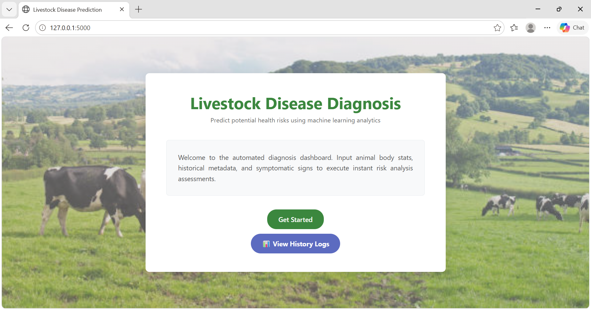
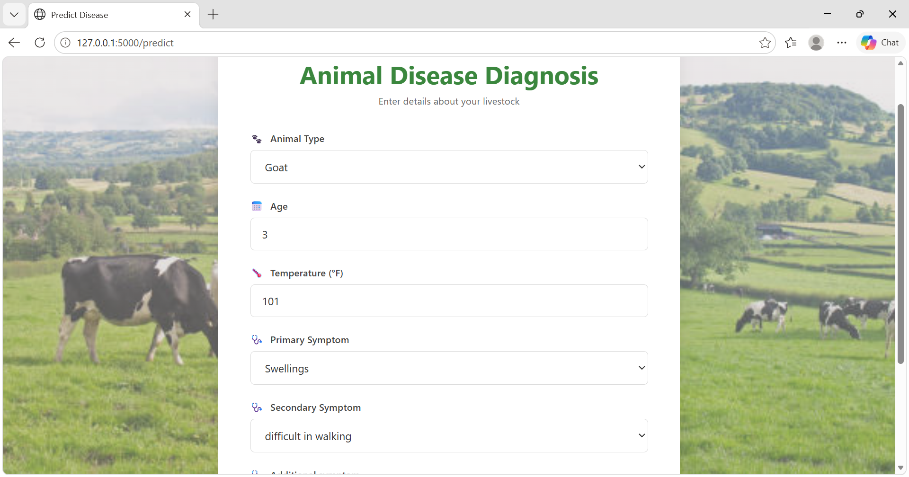
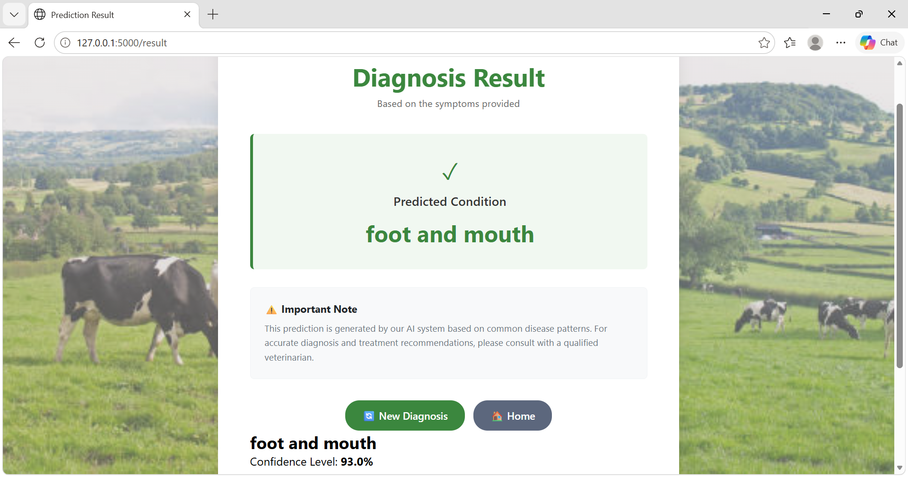
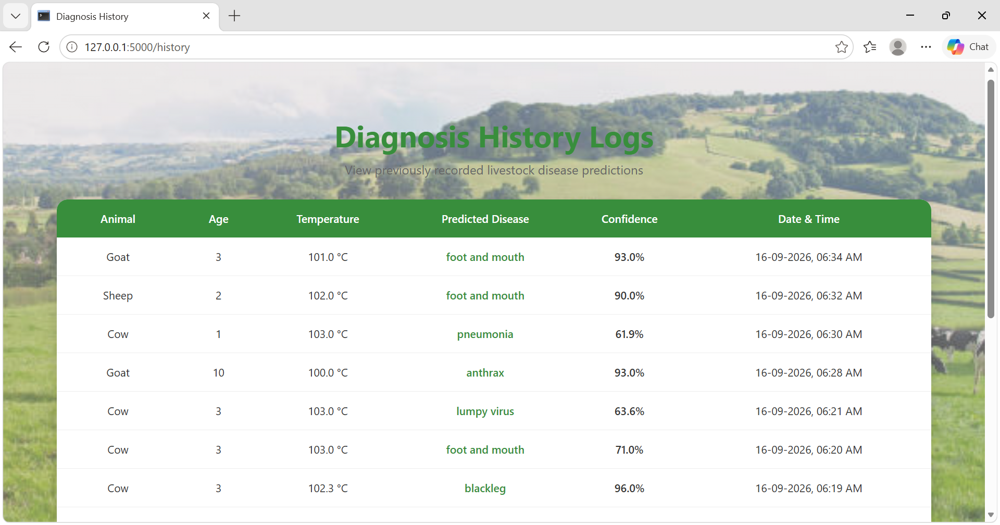
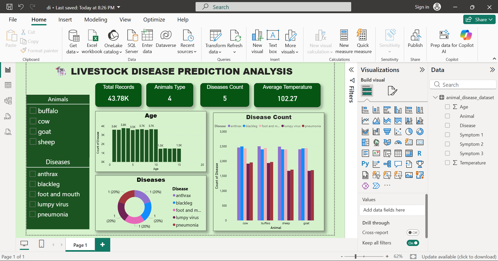

# 🐄 Disease Prediction in Livestock — Machine Learning Application

> **Turning livestock symptoms into meaningful predictions through Machine Learning.**

Disease Prediction in Livestock is a machine learning-based web application designed to predict possible livestock diseases using animal details and observed symptoms.

The project combines a trained **Random Forest classification model** with a **Flask web application**, providing a simple interface where users can enter animal information, select symptoms, and receive a predicted disease.

---

## 🌱 The Idea Behind the Project

Livestock health problems can affect animal well-being as well as the livelihood of farmers.

The idea behind this project was to explore how Machine Learning can be applied to livestock-related data to identify possible diseases from common animal details and symptoms.

> **From data to prediction — building technology with a purpose.** 🐄🌱

---
## ⚙️ How It Works

**01 — Enter Details**
Provide the required animal information.

**02 — Select Symptoms**
Choose the symptoms observed in the animal.

**03 — Generate Prediction**
The trained Random Forest model processes the given information.

**04 — View Result**
The application displays the predicted disease.

**05 — Check History**
Previous diagnosis records can be viewed through the history section.

---

## 🧰 Built With

**Python**
Used for data processing, machine learning, and application development.

**Flask**
Used to build the web application and connect the trained model with the interface.

**Pandas**
Used for loading, organizing, and processing the dataset.

**NumPy**
Used for numerical operations and data preparation.

**Scikit-learn**
Used to train and evaluate the Random Forest classification model.

**HTML & CSS**
Used to build and style the web interface.

---

## 🤖 Machine Learning Approach

The project uses a **Random Forest classification algorithm** to predict possible livestock diseases based on animal information and symptoms.

### 🔄 Prediction Flow

**Animal Details → Symptoms → Data Processing → Random Forest Model → Disease Prediction**

The trained model achieved **91% precision** during evaluation.

---

## 📸 Project Showcase

### 🏠 Home Page



### 📝 Disease Prediction



### 🔍 Prediction Result



### 📋 Diagnosis History



### 📝 Power BI Report


---

## 📂 Project Structure

```text
Disease-Prediction-in-Livestock/
│
├── app.py
├── requirements.txt
├── ...
│
├── templates/
│   ├── index.html
│   └── history.html
│
├── static/
│   ├── css/
│   ├── js/
│   └── images/
│
├── screenshots/
│   ├── homepage.png
│   ├── prediction.png
│   ├── result.png
│   └── history.png
│
└── ...
```

### 👩‍💻 Developed By

**Poornima**
Computer Science Engineering Graduate
